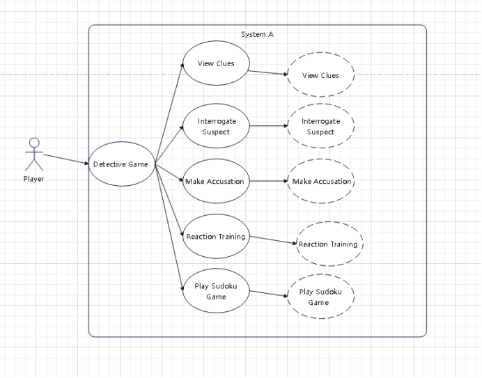
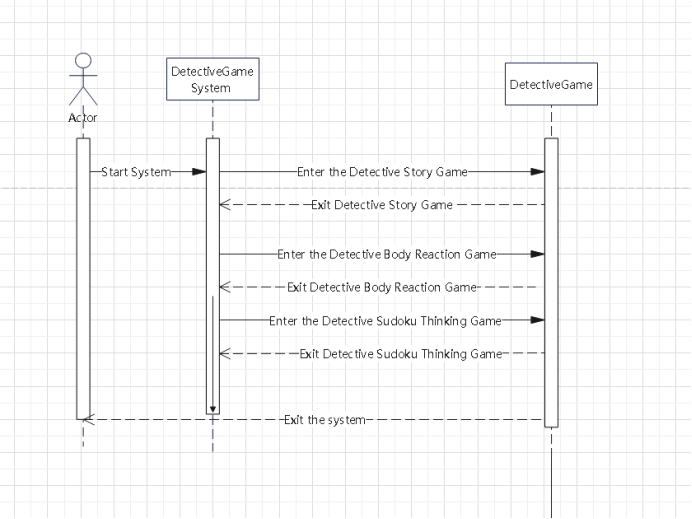
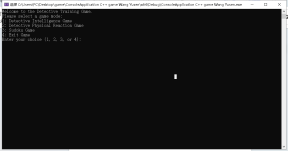
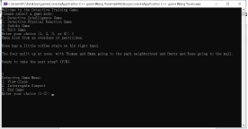
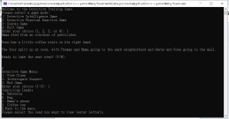
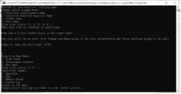
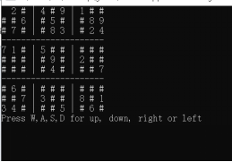
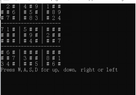

# Report of 3016 c++ game
Name:Wang Yusen
Student Number: 10872392

## Introduction
This is a small text-based game that focuses on describing three mini-games from the point of view of a young detective, with a detective reasoning short story, a detective reflexes test mini-game, and a sudoku game that exercises the detective's logical thinking skills.

## Information and validation of my VS code

Microsoft Visual Studio Community 2022
Version 17.7.6
VisualStudio.17.Release/17.7.6+34221.43
Microsoft .NET Framework
Version 4.8.09037

Installed versions: Community
Visual C++ 2022   
Microsoft Visual C++ 2022

ASP.NET and Web Tools   17.7.274.37181
ASP.NET and Web Tools

## How to Play
First, the user enters the game first, and the user has three game modes to choose from, Detective Reasoning Game, Detective Physical Reaction Game, and Detective Sudoku Game. Detective reasoning game is you are a small detective, you need to solve a case, this case has a specific description, you can press enter to continue to read the following information, and then you can view the items left at the scene, as well as interrogate the suspect, to find the wrong culprits you will be revoked the qualification of detectives, to find the right suspects you can become a qualified detective, and to understand the case of the cause of the process! You can then look at the items left at the scene and interrogate the suspects. Physical reaction game is you need to control the WASD four keys, within 1 second to react out of the screen corresponding to the keys, 30 points is successful, you can also replay this.DetectiveDetective SudokuDetective SudokuDetective Sudoku is a game that lets youDetective Sudoku is for you to complete aDetective Sudoku game is for you to complete a sudoku!Detective Sudoku game is for you to complete a sudoku.Detective Sudoku game is for you to complete a sudoku, after completing the sudoku, you will be able to find out what happened.Detective Sudoku game is to let you complete a sudoku, after completing will congratulate you!Detective Sudoku game is to let you complete a sudoku, after completing will congratulate you for completing!Detective Sudoku game is to let you complete a sudoku, after completing will congratulate you!Detective Sudoku game is for you to complete a sudoku, after completing it, you will be congratulated!Detective Sudoku game is to let you complete a sudoku, after completing will congratulate you!Detective Sudoku game is for you to complete a sudoku, after completing the game, you will be congratulated on your success.Detective Sudoku game is for you to complete a sudoku, after completing the game, you will be congratulated for completing it correctly!Detective Sudoku game is to let you complete a sudoku, after completing the sudoku will congratulate you for completing the sudoku correctly!Detective Sudoku game is to let you complete a sudoku, after completing the sudoku will congratulate you for completing the sudoku completely correctly.

## UML Diagram

### Class diagram

### Use case diagram

### Sequence diagram

## Exception handling and test cases

### Test cases:
Test|Expected Results|Actual Results|Conclusion
---|---|---|---|
compilation program|||Pass
Choose the first game|||Pass
Choose view clues|||Pass
Choose item|||Pass
Interrogate the suspect|||Pass
Choose a suspect|||Pass
Choose the correct suspect|||Pass
Choose the incorrect  suspect|||Pass
Open the second game|||Pass
Open the Sudoku game|||Pass
## How Prototypes work
The given C++ code represents a game that's text based. It offers game play elements like examining clues questioning suspects and engaging in mini games such, as reaction training and Sudoku. Now lets analyze how the function prototypes are utilized throughout the flow of the game;

 Function;

This function serves as the starting point of the program. It establishes the game loop where players can select gaming modes.
displayMenu() Function;

Within the ) loop this function is called to present players with options like examining clues or interrogating suspects. It utilizes a loop to display the menu until the game is exited.
viewClues() Function;

When players choose to examine clues in the displayMenu() this function is triggered. It provides types of clues (such as an umbrella, bag, phone, coffee cup) for players to select from and explore their details.
viewUmbrellaDetails() viewBagContents() viewPhoneRecords() viewCoffeeCupDetails() Functions;

Depending on what clue was chosen in viewClues() these functions are called individually to display details, about each selected clue.

The displayStoryAndClues() function can be used when the game starts to present the story and initial clues, to the player. Depending on the players input it can. Take them to the menu or proceed with the storyline. 

Similarly the getPlayerChoice() function allows players to make choices within the game. They can select options that influence how the game progresses and impacts their experience.

When the player decides to interrogate a suspect they can use the "interrogateSuspect" function. This function requires the suspects character identifier as input. Provides a narrative, for the interrogation.

To make an accusation the player can use the "makeAccusation" function. This function compares the players input with the answer. Returns a boolean value indicating whether the accusation is correct or not.
## Code List
~~~
'#include <iostream>
#include <limits>
#include <string>
#include <conio.h> 
#include <ctime> 
#include <chrono>
#include <thread>
#include <unordered_map>

using namespace std;
void pressEnterToContinue();
bool displayStoryAndClues();
char getPlayerChoice();
void interrogateSuspect(char suspect);
bool makeAccusation();
void reactionTraining();
void sudokuGame(); 
bool isValidSudoku();
void displayMenu();
void viewClues();
void viewUmbrellaDetails();
void viewBagContents();
void viewPhoneRecords();
void viewCoffeeCupDetails();
bool isGridFull();

void pressEnterToContinue() {
    cin.ignore(numeric_limits<streamsize>::max(), '\n');
}

void displayClue(const string& clue) {
    cout << clue << endl;
    pressEnterToContinue();
}

unordered_map<string, string> cluesDetails = {
    {"umbrella", "It was soaked on top, indicating that someone had been in the rain."},
    {"bag", "There's a picture in there of the four of them together, but Thomas and Rose's bracelets look similar."},
    {"phone", "There were a couple of missed messages, a missed call from Rose and a missed call from Thomas."},
    {"coffeeCup", "It appears to be the cause of the deceased's death, with residual poison in the cup."}
};
void displayMenu() {
    char choice;

    while (true) {
        cout << "Detective Game Menu:\n";
        cout << "1. View Clues\n";
        cout << "2. Interrogate Suspect\n";
        cout << "3. End Game\n";
        cout << "Enter your choice (1-3): ";
        cin >> choice;
        cin.ignore(numeric_limits<streamsize>::max(), '\n');

        if (choice == '1') {
            viewClues();
        }
        else if (choice == '2') {
            char suspect = getPlayerChoice(); // Assign a value before using it
            interrogateSuspect(suspect);
        }
        else if (choice == '3') {
            cout << "Thank you for playing. Goodbye!\n";
            return; // Exit the function, not the program
        }
        else {
            cout << "Invalid choice. Please re-enter.\n";
        }
    }
}

// View the clues
void viewClues() {
    char clueChoice;
    cout << "Suspicious leads：\n";
    cout << "A. Umbrella\n";
    cout << "B. Bag\n";
    cout << "C. Emma's phone\n";
    cout << "D. Coffee cup\n";
    cout << "E.Back to the manu\n";
    cout << "Please select the lead you want to view (enter letter)：";
    cin >> clueChoice;
    cin.ignore(numeric_limits<streamsize>::max(), '\n');

    if (clueChoice == 'A') {
        viewUmbrellaDetails();
    }
    else if (clueChoice == 'B') {
        viewBagContents();
    }
    else if (clueChoice == 'C') {
        viewPhoneRecords();
    }
    else if (clueChoice == 'D') {
        viewCoffeeCupDetails();
    }
    else if (clueChoice == 'E') {
        displayMenu();
    }
    else {
        cout << "Invalid selection, please re-enter.\n";
    }

}

// View Umbrella details
void viewUmbrellaDetails() {
    cout << "Umbrella：" << cluesDetails["umbrella"] << endl;
    pressEnterToContinue();
    viewClues(); // Back to menu
}

// View bag details
void viewBagContents() {
    cout << "Bag：" << cluesDetails["bag"] << endl;
    pressEnterToContinue();
    viewClues(); // Back to menu
}

// View phone details
void viewPhoneRecords() {
    cout << "Emma's phone：" << cluesDetails["phone"] << endl;
    pressEnterToContinue();
    viewClues(); // Back to menu
}

// View coffee cup details
void viewCoffeeCupDetails() {
    cout << "Coffee cup：" << cluesDetails["coffeeCup"] << endl;
    pressEnterToContinue();
    viewClues();// Back to menu
}
bool displayStoryAndClues() {
    string clues[] = {
        "Emma died from an overdose of pesticides.",
        "Rose has a little coffee stain on his right hand.",
        "The four split up at noon, with Thomas and Emma going to the park neighborhood and Herny and Rose going to the mall.",
        
    };

    for (const auto& clue : clues) {
        displayClue(clue);
    }

    char choice;
    cout << "Ready to take the next step? (Y/N).";
    cin >> choice;
    cin.ignore(numeric_limits<streamsize>::max(), '\n');

    if (choice == 'Y' || choice == 'y') {
        displayMenu();  // Calling menu display functions
        return false;   // Returning false means the story is over and the user has entered the menu

    }
    return true;  // Returning true means that the user is not ready and may continue the story or end the game
}

char getPlayerChoice() {
    cout << "Options:\nA: Interrogate Rose\nB: Interrogate Herny\nC: Interrogate Thomas\nD: Choose the culprit\n";
    cout << "Please enter your choice (A, B, C, D) or exit (X): ";
    char choice;
    cin >> choice;
    // Consume the remaining newline character
    cin.ignore(numeric_limits<streamsize>::max(), '\n');
    return choice;
}

void interrogateSuspect(char suspect) {
    if (suspect == 'A') {
        cout << "Interrogating Rose: \"I was at the mall all afternoon. How could this happen to Emma? I was with Herny for a while, but maybe it was too noisy, I didn't hear my phone. Oh, why did this happen to Emma?\"\n";
    }
    else if (suspect == 'B') {
        cout << "Interrogating Herny: \"I never sent any messages to Thomas, I didn't use my phone at all in the afternoon. I was in the arcade waiting for Rose, it was only Thomas and Emma together!\"\n";
    }
    else if (suspect == 'C') {
        cout << "Interrogating Thomas: \"I was with Emma all the time until I got a text from Rose asking me to meet him at the mall, it must have been him, he's so petty, only remembering how Emma rejected him!\"\n";
    }
    else if (suspect == 'D') {
        makeAccusation();
    }
    pressEnterToContinue();
}

bool makeAccusation() {
    cout << "Please choose the suspect you think is the murderer (enter the suspect's name):" << endl;
    string suspect;
    cin >> suspect;
    // Consume the remaining newline character
    cin.ignore(numeric_limits<streamsize>::max(), '\n');
    if (suspect == "Rose") {
        cout << "Correct! You've identified the murderer!" << endl;
        return true;
    }
    else {
        cout << "Incorrect! That is not the murderer." << endl;
        return false;
    }
}

// Function Prototype Declaration
void reactionTraining();

···
#include <iostream>
#include <limits>
#include <string>
#include <conio.h> 
#include <ctime> 

using namespace std;

// Declaring Other Functions
void pressEnterToContinue();
bool displayStoryAndClues();
char getPlayerChoice();
void interrogateSuspect(char suspect);
bool makeAccusation();
void reactionTraining(); // Statement of physical training games

int main() {
    bool exitGame = false;

    while (!exitGame) {
        cout << "Welcome to the Detective Training Game.\n";
        cout << "Please select a game mode:\n";
        cout << "1: Detective Intelligence Game\n";
        cout << "2: Detective Physical Reaction Game\n";
        cout << "3: Sudoku Game\n";
        cout << "4: Exit Game\n";
        cout << "Enter your choice (1, 2, 3, or 4): ";

        char gameChoice;
        cin >> gameChoice;
        cin.ignore(numeric_limits<streamsize>::max(), '\n'); // Clear input buffer

        switch (gameChoice) {
        case '1':
            // Detective Intelligence Game
            if (!displayStoryAndClues()) {
                continue;
            }
            while (true) {
                char choice = getPlayerChoice();
                if (choice == 'X' || choice == 'x') {
                    cout << "Thank you for playing!\n";
                    break;
                }
                else if (choice == 'D') {
                    if (makeAccusation()) {
                        cout << "Congratulations! You've solved the case and caught the murderer." << endl;
                    }
                    else {
                        cout << "Wrong answer, your detective qualification is revoked.\n";
                    }
                    break; // Exit game
                }
                else {
                    interrogateSuspect(choice);
                }
            }
            break;
        case '2':
            // Physical Reaction Training Game
            reactionTraining();
            break;
        case '3':
            // Sudoku Game
            sudokuGame();
            break;
        case '4':
            cout << "Exiting game.\n";
            exitGame = true; // Set exit flag
            break;
        default:
            cout << "Invalid input, please re-select.\n";
            break;
        }
    }

    return 0;
}

void reactionTraining() {
    cout << "Next is the detective's physical training.\n";
    cout << "A real detective might face a struggle with criminals when uncovering the truth.\n";
    cout << "The four directions: up, down, left, right, represent punches, elbows, dodges, and leg power respectively.\n";
    cout << "You need to respond with the correct counter to succeed!\n";
    cout << "Are you ready to start the game? Press Enter to continue.\n";
    cin.ignore(numeric_limits<streamsize>::max(), '\n');

    const char* arrows[] = { "↑", "↓", "←", "→" };
    const char keys[] = { 'w', 's', 'a', 'd' };
    int score = 0;
    char input = '\0'; // Initialize input variable
    bool restart = false;

    do {
        score = 0; // Reset score
        restart = false; // Reset restart flag
        srand(static_cast<unsigned int>(time(nullptr)));

        while (score < 30) {
            int index = rand() % 4;
            cout << "Press " << keys[index] << " corresponding to " << arrows[index] << endl;

            int startTime = clock();
            bool keyPressed = false;

            while ((clock() - startTime) / CLOCKS_PER_SEC < 1) {
                if (_kbhit()) {
                    keyPressed = true;
                    char ch = _getch();
                    if (ch == keys[index]) {
                        score++;
                        cout << "Correct! Current score: " << score << endl;
                        break; // Immediately break the loop after the correct key is pressed
                    }
                    else {
                        cout << "Incorrect! Press 'R' to restart or Enter to exit.\n";
                        input = _getch();
                        if (input == 'r' or input == 'R') {
                            restart = true;
                        }
                        break; // Break the loop after the wrong key is pressed
                    }
                }
            }

            if (!keyPressed) { // If no key was pressed
                cout << "Time's up! Your detective qualification is revoked! Press 'R' to restart or Enter to exit.\n";
                input = _getch();
                if (input == 'r' or input == 'R') {
                    restart = true;
                }
                break; // Break the loop after timeout
            }

            if (restart) break; // If restart is needed, break the loop to start a new game

            if (!keyPressed && (input == '\r' or input == '\n')) {
                cout << "Game over. Your score is: " << score << endl;
                return; // End the game if the user times out and doesn't choose to restart
            }
        }

        if (score == 30) {
            cout << "Congratulations! You have completed the physical training!" << endl;
            break; // Break the loop after reaching a score of 30
        }

    } while (restart); // Continue the do...while loop if the user chooses to restart

    cout << "Press Enter to exit the game.\n";
    cin.ignore(numeric_limits<streamsize>::max(), '\n');
}

const int gridSize = 9;
char grid[gridSize][gridSize] = {
    {'#', '2', '#', '4', '#', '9', '1', '#', '#'},
    {'#', '#', '6', '#', '5', '#', '#', '8', '9'},
    {'#', '7', '#', '#', '8', '3', '#', '2', '4'},
    {'7', '1', '#', '5', '#', '#', '#', '#', '#'},
    {'#', '#', '#', '#', '9', '#', '2', '#', '#'},
    {'#', '#', '#', '#', '4', '#', '#', '#', '7'},
    {'#', '6', '#', '#', '#', '#', '#', '#', '#'},
    {'#', '#', '7', '3', '#', '#', '8', '#', '1'},
    {'3', '4', '#', '#', '#', '5', '#', '6', '#'}
};

const char emptyCell = '#'; // Define a constant to represent an empty cell

void printGrid(int selectedX, int selectedY, bool highlight = false) {
    system("cls");
    for (int i = 0; i < gridSize; ++i) {
        for (int j = 0; j < gridSize; ++j) {
            if (i == selectedX && j == selectedY) {
                if (grid[i][j] == emptyCell || highlight) {
                    cout << "  "; // If the cell is empty or needs to be highlighted, print the space
                }
                else {
                    cout << grid[i][j] << ' ';
                }
            }
            else {
                cout << grid[i][j] << ' ';
            }
            if ((j + 1) % 3 == 0 && j < gridSize - 1) cout << "| ";
        }
        cout << endl;
        if ((i + 1) % 3 == 0 && i < gridSize - 1) {
            cout << "---------------------" << endl;
        }
    }
}

void blinkCell(int x, int y) {
    printGrid(x, y, true); // Call Highlight Print
    this_thread::sleep_for(chrono::milliseconds(200)); // Short pause to create a flashing effect
    printGrid(x, y, false); // The call prints normally.
}
void sudokuGame() {
    cout << endl;
    cout << "To ensure a detective's logical thinking skills, a qualified detective needs to train Sudoku every day to practice their logic.\n";
    cout << "Press Enter to start your Sudoku training..." << endl;
    cin.ignore(numeric_limits<streamsize>::max(), '\n'); // Waiting for the user to press Enter
    int x = 0, y = 0;
    printGrid(x, y);
    cout << "Press W,A,S,D for up, down, right or left" << endl;
    char ch;
    do {
        ch = _getch();
        switch (ch) {
        case 'w': if (x > 0) x--; break;
        case 's': if (x < gridSize - 1) x++; break;
        case 'a': if (y > 0) y--; break;
        case 'd': if (y < gridSize - 1) y++; break;
        case '0':
            if (grid[x][y] != emptyCell) {
                grid[x][y] = emptyCell;
            }
            break;
        default:
            if (ch >= '1' && ch <= '9' && grid[x][y] == emptyCell) {
                grid[x][y] = ch;
            }
            break;
        }

        printGrid(x, y);

        if (isGridFull()) {
            if (isValidSudoku()) {
                cout << "Challenge successful! You have correctly completed the Sudoku!" << endl;
                break; // Exit the loop if the Sudoku is complete and valid
            }
            else {
                cout << "The Sudoku is full but incorrect. Please check your inputs." << endl;
            }
        }

        cout << "When choose: (" << x << ", " << y << ")\n";
        cout << "Enter the number 1-9 to padding，enter '0' to backspace，enter'q' to exit。\n";
    } while (ch != 'q');

    cout << "Press Enter to return to the game selection menu..." << endl;
    cin.ignore(numeric_limits<streamsize>::max(), '\n');
}

bool isGridFull() {
    for (int row = 0; row < gridSize; ++row) {
        for (int col = 0; col < gridSize; ++col) {
            if (grid[row][col] == emptyCell) {
                // If any cell is still the emptyCell, the grid is not full
                return false;
            }
        }
    }
    // If no empty cells are found, the grid is full
    return true;
}

bool isValidSudoku() {
    for (int i = 0; i < gridSize; i++) {
        bool row[gridSize + 1] = { false };
        bool column[gridSize + 1] = { false };
        bool block[gridSize + 1] = { false };
        for (int j = 0; j < gridSize; j++) {
            // check list
            if (grid[i][j] != emptyCell) {
                if (row[grid[i][j] - '0']) return false;
                row[grid[i][j] - '0'] = true;
            }
            // check list
            if (grid[j][i] != emptyCell) {
                if (column[grid[j][i] - '0']) return false;
                column[grid[j][i] - '0'] = true;
            }
            // Check 3x3 blocks
            int BlockRow = 3 * (i / 3);
            int BlockCol = 3 * (i % 3);
            char blockValue = grid[BlockRow + j / 3][BlockCol + j % 3];
            if (blockValue != emptyCell) {
                if (block[blockValue - '0']) return false;
                block[blockValue - '0'] = true;
            }
        }
    }
    return true;
}
~~~

# Video Link
You can watch my video by using the link below to get my introduction:
https://youtu.be/HICm0EiDleQ

# Github Link
github.com/YusenWang90
